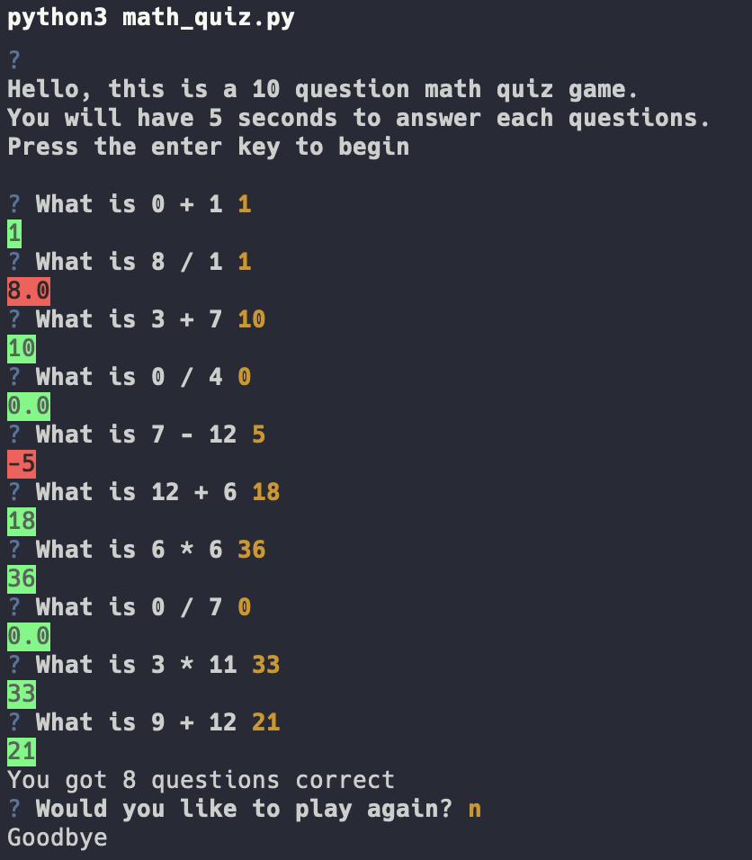

# Math Quiz Game

## Description

This Math Quiz Game is a simple and interactive console application written in Python. It challenges users with a series of basic arithmetic questions (addition, subtraction, multiplication, and division) within a specified time limit. It's a great tool for anyone looking to sharpen their quick math skills.

## Features

- Generates random arithmetic questions.
- Timed responses, enhancing the challenge.
- Immediate feedback on answers.
- Option to replay the game after completion.

## Technologies

- Python
- Libraries: 'questionary', 'termcolor', 'random', 'Queue', 'threading'

## Setup and Installation

To run this game, you need Python installed on your system. Additionally, the 'questionary' and 'termcolor' libraries are used for interactive prompts and colored terminal text, respectively. Furthermore, 'queue' and threading are using in conjunction to have each question have a 5 second time limit. Finally, 'random' is used to generate the numbers of each question

## Game Demo

